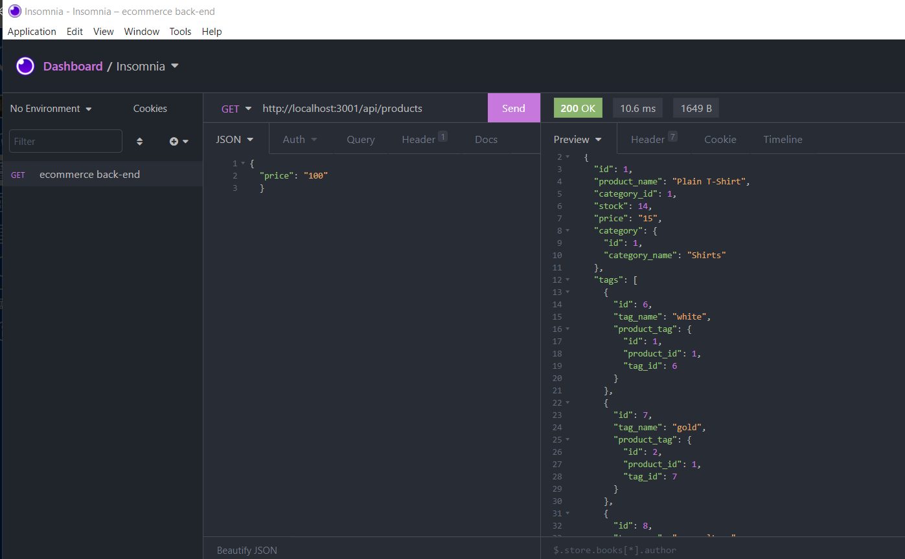

# E-commerce Back End

  
    
  
   
  
   
  
   
  
   
  

  
  ## User Story 

  * AS A manager at an internet retail company
  * I WANT a back end for my e-commerce website that uses the latest technologies
  * SO THAT my company can compete with other e-commerce companies

  ## Acceptance Criteria
  
  * GIVEN a functional Express.js API
  * WHEN I add my database name, MySQL username, and MySQL password to an environment variable file
  * THEN I am able to connect to a database using Sequelize
  * WHEN I enter schema and seed commands
  * THEN a development database is created and is seeded with test data
  * WHEN I enter the command to invoke the application
  * THEN my server is started and the Sequelize models are synced to the MySQL database
  * WHEN I open API GET routes in Insomnia Core for categories, products, or tags
  * THEN the data for each of these routes is displayed in a formatted JSON
  * WHEN I test API POST, PUT, and DELETE routes in Insomnia Core
  * THEN I am able to successfully create, update, and delete data in my database
   
  ## Table of Contents
  - [Description](#description)
  - [Documentation](#documentation)
  - [Usage](#usage)
  - [Screenshot](#screenshot)
  - [Features](#features)
  - [Acknowledgements](#acknowledgements)
  - [License](#license)
  - [Testing](#testing)
  - [Contact](#contact)

  ## Documentation
  Details coming soon!
 
  ## Usage
  Details coming soon!

  ## Screenshot
  

  ## Features
  Details coming soon!
  
  # Acknowledgements
  
  * Rob Atalla
   
  * KU Coding Bootcamp, Module 13 Challenge Assignment © 2021 Trilogy Education Services, LLC, a 2U, Inc. brand Confidential and Proprietary.
  All Rights Reserved.
  
    
  ## License
  
   
  Permission to use this application is granted under the MIT license. <https://opensource.org/licenses/MIT>

  ## Testing
  Jest, Insomnia

  ## Contact:
  Holler at me! <a href="mailto:rob.atalla@robatalla816.com">rob.atalla@robatalla816.com</a>